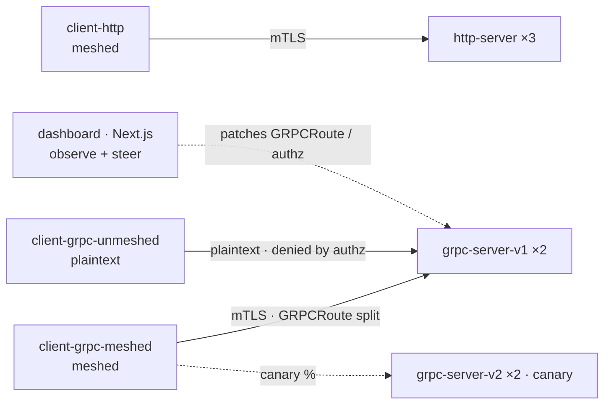

# Apps Simplified: Use a Mesh from Day 0

Self-contained Kubernetes Helm chart showing what a service mesh gives a gRPC app from day one: live canary routing via the Gateway API, automatic mTLS, identity-based authorization, and zero-instrumentation golden-metrics observability — built on [Linkerd](https://linkerd.io). Companion demo for the KCD Kuala Lumpur 2026 talk *"Apps Simplified: Use a Mesh from Day 0."*

Everything — dashboard, servers, and traffic clients — is TypeScript (Next.js + Node), matching a typical product stack so the mesh, not the app, is the star.

> **The demo lives in [`demo/`](demo/).** Run every command from there. This page is the map; deep docs are in [`demo/docs/`](demo/docs/).

## What it demonstrates

Four things you get for free the moment you mesh an app — each with a live, interactive showcase:

- **gRPC canary routing** — a Gateway API `GRPCRoute` splits gRPC traffic by weight between `grpc-server-v1` and `grpc-server-v2`. The split is an *outbound* policy enforced by the **client's** proxy, so only meshed clients honor it. Shift weights live with `make canary V1=90 V2=10`.
- **Automatic mTLS** — meshed pods talk over mutual TLS with no app changes. The dashboard's *Sniff the Wire* button runs `tcpdump` via `kubectl debug` to prove meshed traffic is encrypted while the unmeshed client sends cleartext.
- **Identity-based authorization** — an `AuthorizationPolicy` + `MeshTLSAuthentication` flips the gRPC service to default-deny, admitting only meshed identities. The unmeshed client gets `PERMISSION_DENIED` — security by impossibility, toggled live from the dashboard.
- **Golden-metrics observability** — optional Prometheus scrapes the Linkerd proxies (success rate, RPS, latency, mTLS coverage) and pre-provisioned Grafana dashboards render them. Zero app instrumentation.

## Architecture

Dedicated client pods generate all load; the dashboard only observes and steers (it patches `GRPCRoute` weights and authz policies via `kubectl`).



Workloads (Helm release `kcd-kl-2026`, namespace `todea`):

| Component | Role |
| --- | --- |
| `dashboard` | Next.js UI + aggregator; serves React frontend and API routes; steers canary/authz/sniff. Generates no traffic. |
| `http-server` ×3 | HTTP/1.1 echo servers that stamp responses with server/pod/version. |
| `grpc-server-v1` ×2 | Stable gRPC echo (`EchoService.Echo`). |
| `grpc-server-v2` ×2 | Canary gRPC echo — the `GRPCRoute` weight target. |
| `client-http` | Meshed HTTP load generator. |
| `client-grpc-meshed` | Meshed gRPC load (mTLS, honors the canary split). |
| `client-grpc-unmeshed` | Unmeshed gRPC load (plaintext, ignores the canary, blocked by authz). |
| Prometheus + Grafana | Optional observability subcharts. |

See [`demo/docs/architecture.md`](demo/docs/architecture.md) for the full traffic-flow walkthrough.

## Repository layout

```
.
├── demo/                 # the demo — run all commands from here
│   ├── Makefile          # images / deploy / canary / urls / clean ...
│   ├── dashboard/        # Next.js UI + aggregator + live controls
│   ├── http-server/      # HTTP echo server (TypeScript)
│   ├── grpc-server/      # gRPC echo server, v1 + v2 (TypeScript)
│   ├── client/           # unified HTTP/gRPC traffic generator
│   ├── proto/echo.proto  # shared gRPC contract (EchoService)
│   ├── chart/            # Helm umbrella chart (kcd-kl-2026)
│   ├── docs/             # architecture, deployment, configuration, showcases, development
│   └── settings.sh.example  # optional Buoyant Enterprise trial credentials
└── slides/               # talk deck (PDF)
```

## Quickstart

**Prerequisites:** [Docker](https://www.docker.com/), [k3d](https://k3d.io), [kubectl](https://kubernetes.io/docs/reference/kubectl/), [Helm](https://helm.sh) 3.13+, and the [Linkerd CLI](https://linkerd.io/2/getting-started/). Images run locally via k3d import — no registry needed.

```bash
cd demo

# 1. One-time: cluster + Gateway API CRDs + Linkerd
k3d cluster create traffic-demo --agents 2 -p 80:80@loadbalancer --wait
kubectl apply -f https://github.com/kubernetes-sigs/gateway-api/releases/download/v1.2.0/standard-install.yaml
linkerd install --crds | kubectl apply -f -
linkerd install        | kubectl apply -f -
linkerd check

# 2. Build images and deploy the chart
make images
make deploy

# 3. Open the dashboard, press "Start traffic", and run the showcases
make urls   # prints the ingress URLs
```

Then visit **http://demo.localhost** (Prometheus at **http://prometheus.localhost**, Grafana at **http://grafana.localhost**, `admin`/`admin`). All three resolve through the k3d LoadBalancer ingress — no port-forward needed. If ingress isn't available, fall back to `make ui` / `make prom` / `make grafana`.

> **Buoyant Enterprise for Linkerd (optional):** copy `settings.sh.example` to `settings.sh`, fill in your trial credentials, and `source settings.sh` before installing the mesh. Leave it unset to use open-source Linkerd. Full steps in [`demo/docs/deployment.md`](demo/docs/deployment.md).

## Make targets

Run from `demo/` (`make help` lists them all):

| Target | What it does |
| --- | --- |
| `make images` | Build the four images (http-server, grpc-server, dashboard, client) and import them into k3d. |
| `make deps` | Fetch/unpack the Prometheus + Grafana subcharts. |
| `make deploy` | Install/upgrade the `kcd-kl-2026` Helm release. |
| `make urls` | Print the ingress URLs (demo / prometheus / grafana). |
| `make canary V1=90 V2=10` | Shift the gRPC canary split live (patches the `GRPCRoute`). |
| `make ui` / `make prom` / `make grafana` | Port-forward fallbacks for dashboard / Prometheus / Grafana. |
| `make clean` | Uninstall the Helm release. |

## Showcases

Suggested live flow once traffic is running (details in [`demo/docs/showcases.md`](demo/docs/showcases.md)):

1. **Canary** — rebalance v1/v2 weights and watch meshed clients follow the split while the unmeshed client stays on v1.
2. **Encryption** — *Sniff the Wire* to compare cleartext (unmeshed) vs. encrypted (meshed) packets on the wire.
3. **Authorization** — enforce the policy and watch the unmeshed client fail with `PERMISSION_DENIED`.
4. **Observability** — explore request rate, success rate, and mTLS coverage in Prometheus/Grafana.

## Documentation

- [Architecture](demo/docs/architecture.md) — components and traffic flow
- [Deployment](demo/docs/deployment.md) — cluster, mesh, and chart install
- [Configuration](demo/docs/configuration.md) — Helm values and options
- [Showcases](demo/docs/showcases.md) — running each scenario
- [Development](demo/docs/development.md) — local (non-cluster) dev workflow

## Talk

Slide deck: [`slides/Apps Simplified.pdf`](slides/). Talk: *"Apps Simplified: Use a Mesh from Day 0"* — KCD Kuala Lumpur 2026.

## License

[Apache License 2.0](LICENSE).
