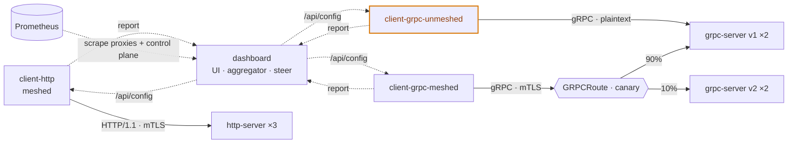

# gRPC Canary + Mesh Security

A self-contained Kubernetes demo for the talk **"Apps Simplified: Use a Mesh from
Day 0"** (KCD Kuala Lumpur 2026), packaged as a **Helm chart**. Dedicated client
pods drive **HTTP** and **gRPC** traffic at tiny servers while a live dashboard
(styled like [todea.co.kr](https://todea.co.kr)) observes them and steers the
load, showing what a service mesh (Linkerd) gives you the moment you adopt it —
using gRPC, where it matters.

All visible in the dashboard:

1. **gRPC canary** — a Gateway API `GRPCRoute` splits gRPC between `grpc-server`
   **v1** and **v2** by weight; shift it live and watch the mix move.
2. **Authorization** — apply a policy so only meshed identities reach gRPC;
   `client-grpc-unmeshed` flips to `PERMISSION_DENIED`. One click, before/after.
3. **Encryption** — click **Sniff the wire** to prove the unmeshed payload is
   plaintext and the meshed one is mTLS, with the capture shown inline.
4. **Observability** — optional **Prometheus** + **Grafana** subcharts; Prometheus
   scrapes the Linkerd **proxies and control plane**.



## Stack

TypeScript throughout, matching the Todea website: **dashboard** (Next.js +
Tailwind + a server-side aggregation engine, no traffic), **client** (one unified
HTTP/gRPC client image, deployed as three pods), **http-server** (Node stdlib),
**grpc-server** (`@grpc/grpc-js`). Deployed with Helm; Prometheus + Grafana are
optional subcharts.

## Quick start

```bash
# 1. cluster + mesh — see docs/deployment.md
k3d cluster create traffic-demo --agents 2 -p "80:80@loadbalancer" --wait
kubectl apply -f https://github.com/kubernetes-sigs/gateway-api/releases/download/v1.2.0/standard-install.yaml
linkerd install --crds | kubectl apply -f - && linkerd install | kubectl apply -f -

# 2. images + deploy
make images
make deploy
make urls           # dashboard, Prometheus, Grafana — all on *.localhost (no port-forward)
```

Open **http://demo.localhost**, press **Start traffic**, then drive the showcases.
`make help` lists targets; `make canary V1=50 V2=50` shifts the canary; the
authorization and sniff showcases are buttons in the dashboard.

## Documentation

- [docs/architecture.md](docs/architecture.md) — components, request flow, the
  canary, mesh integration, dashboard internals, observability.
- [docs/deployment.md](docs/deployment.md) — cluster, mesh install (OSS or BEL),
  images, Helm, access, teardown.
- [docs/showcases.md](docs/showcases.md) — how to run the canary, authorization,
  encryption, and metrics demos.
- [docs/configuration.md](docs/configuration.md) — every chart value and env var.
- [docs/development.md](docs/development.md) — project layout, local UI dev, build.

## Layout

```
demo/
├── proto/echo.proto          # shared contract (vendored into the consumers)
├── http-server/              # TS HTTP echo server
├── grpc-server/              # TS gRPC echo server
├── client/                   # TS unified HTTP/gRPC traffic client (one image, three pods)
├── dashboard/                # Next.js observer UI + aggregation engine
├── chart/                    # umbrella Helm chart (+ prometheus/grafana subcharts)
├── docs/                     # documentation
└── Makefile                  # images · deploy · ui · prom · grafana · canary · clean
```
