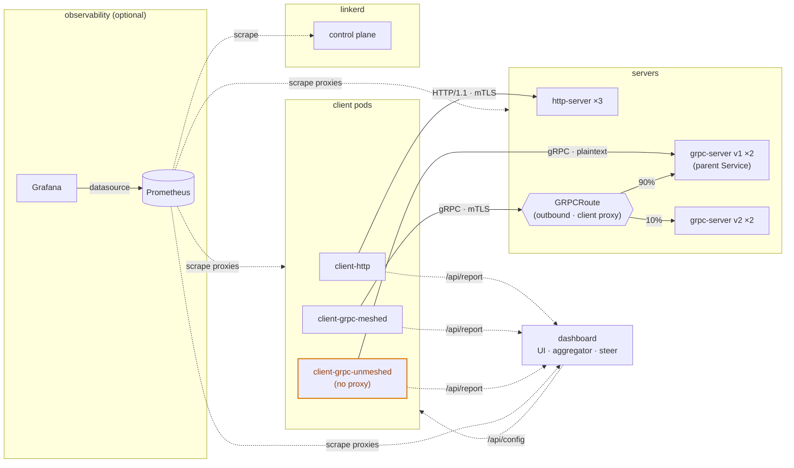

# Architecture

Dedicated client pods drive **HTTP** and **gRPC** traffic at tiny echo servers on
Kubernetes, and a live dashboard observes them and shows what a service mesh
(Linkerd) adds: gRPC canary routing, mTLS encryption, and authorization — with
Prometheus/Grafana for metrics.

## Components

| Workload               | Meshed | Role                                                        |
|------------------------|--------|-------------------------------------------------------------|
| `dashboard`            | yes    | Next.js observer UI + aggregator + steering (no traffic)    |
| `http-server` ×3       | yes    | HTTP/1.1 echo, reports its identity (name, pod, version)    |
| `grpc-server-v1` ×2    | yes    | gRPC echo, `VERSION=v1`                                      |
| `grpc-server-v2` ×2    | yes    | gRPC echo, `VERSION=v2` (the canary target)                 |
| `client-http`          | yes    | HTTP load at `http-server`, reports each outcome            |
| `client-grpc-meshed`   | yes    | gRPC load at `grpc-server` — mTLS, honors the canary        |
| `client-grpc-unmeshed` | **no** | same gRPC load, but no proxy — plaintext, no identity       |
| `prometheus`           | —      | optional subchart; scrapes the proxies + control plane      |
| `grafana`              | —      | optional subchart; Prometheus datasource pre-provisioned    |

The four demo images are TypeScript, matching the
[todea.co.kr](https://todea.co.kr) stack (Next.js + Node). The three client pods
all run one unified `client` image, parameterized by env (protocol + meshed).

## Request flow

1. The **dashboard** (browser) only drives controls and polls `GET /api/stats`
   every ~700ms. It generates no traffic and never speaks gRPC directly.
2. The three **client pods** produce all the load. Each one polls the dashboard
   at `GET /api/config` for `{running, rps, payloadBytes}` and, while running,
   fires requests at its target at that per-client rate: `client-http` over HTTP
   (`fetch`) at `http-server`, `client-grpc-meshed` and `client-grpc-unmeshed`
   over gRPC (`@grpc/grpc-js`) at `grpc-server`. So the dashboard's **Start/Stop**
   button and the **Rate / client** slider steer the clients.
3. Each server stamps its response with `server`, `pod`, and `version`. Every
   client `POST`s each outcome to the dashboard at `POST /api/report`.
4. The dashboard's **engine** ingests those reports and aggregates rolling stats
   (RPS, latency percentiles, success rate, pod and **version** distribution) into
   the throughput chart, latency, canary mix, and request log, plus a per-client
   **Mesh & security** panel — one card each for `client-http`,
   `client-grpc-meshed`, and `client-grpc-unmeshed`.

## The gRPC canary

- `grpc-server-v1` and `grpc-server-v2` share `app=grpc-server`, differing by
  `version`.
- The **`grpc-server` Service selects only v1**, so a client with no routing
  (`client-grpc-unmeshed`) always lands on v1.
- A Gateway API **`GRPCRoute`** with the `grpc-server` Service as its `parentRef`
  splits traffic between v1 and v2 by weight. Because a Service-parented route is
  an **outbound** policy, it's enforced by the *client's* Linkerd proxy — so only
  **meshed** clients honor the split. `client-grpc-unmeshed` ignores it.
- The gRPC Services must carry **`appProtocol: kubernetes.io/h2c`** so Linkerd
  treats the port as L7 HTTP/2 and applies the GRPCRoute. With an unset or
  non-standard value (e.g. `grpc`), Linkerd marks the port **opaque** (plain TCP)
  and the split is silently ignored — all traffic lands on the parent Service
  (v1). gRPC clients also pin to the backend chosen when the connection opened,
  so existing clients must reconnect after this is first set.
- The dashboard's **Canary** slider patches these weights live (commits on
  release); the dashboard then refreshes its version/pod view so the split shows
  promptly.

This is the crux: the mesh works *for the client*, which is why gRPC's single
long-lived HTTP/2 connection gets balanced across versions/pods only when meshed.

## Mesh integration

- Meshed workloads carry `linkerd.io/inject: enabled` (driven by
  `mesh.enabled`); `client-grpc-unmeshed` carries `disabled`.
- **mTLS** is automatic between meshed pods. `client-grpc-unmeshed`'s traffic is
  plaintext on the wire — provable with the dashboard's *Sniff the wire* button.
- **Authorization**: applying a `Server` + `AuthorizationPolicy` +
  `MeshTLSAuthentication` switches `grpc-server`'s port to default-deny, allowing
  only meshed identities. `client-grpc-unmeshed` then gets `PERMISSION_DENIED`.

## Dashboard internals

- **Engine** — a single server-side singleton (kept on `globalThis` to survive
  dev reloads). Holds the live config the clients poll (running / rps / payload),
  the rolling windows, per-second buckets, the request log, and the outcomes
  ingested from the clients. It generates no traffic itself.
- **API routes** (`src/app/api/*`):
  - `config` — the live `{running, rps, payloadBytes}` the client pods poll.
  - `control` — start/stop/reset/update the steering config.
  - `stats` — the full snapshot the dashboard polls.
  - `report` — ingest a client outcome.
  - `canary` — read / patch the GRPCRoute weights (via kubectl).
  - `policy` — get state / apply / remove the authorization policy (via kubectl).
  - `sniff` — run an ephemeral `tcpdump` capture (via `kubectl debug`).
  - `obs` — expose the Prometheus / Grafana button URLs.
  - `health` — readiness.
- **Live controls** — the *Sniff the wire* and *Authorization* buttons shell out
  to `kubectl` from the dashboard pod, using a ServiceAccount with scoped RBAC
  (`pods/ephemeralcontainers`, `pods/attach`, `pods/log`, `policy.linkerd.io`).
  Gated by `liveControls.enabled`; outside a cluster the buttons disable
  gracefully ("in-cluster only").

## Observability

When the `prometheus` subchart is enabled, it ships scrape jobs for:

- **`linkerd-proxy`** — every injected pod's `linkerd-admin` port (proxy golden
  metrics: success rate, RPS, latency, mTLS).
- **`linkerd-controller`** — the control plane's `admin-http` ports in the
  `linkerd` namespace.

These are the same relabel rules Linkerd Viz uses (see
`prometheus.extraScrapeConfigs` in `chart/values.yaml`). When `grafana` is
enabled, the chart provisions that Prometheus as a Grafana datasource.

See [configuration.md](configuration.md) for every value and env var, and
[showcases.md](showcases.md) for how to drive the demo.
